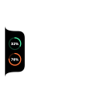
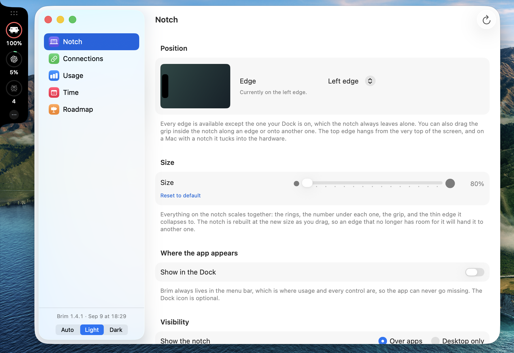
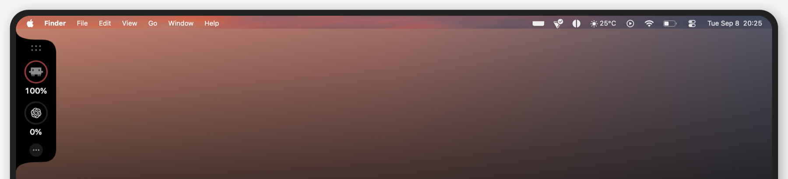
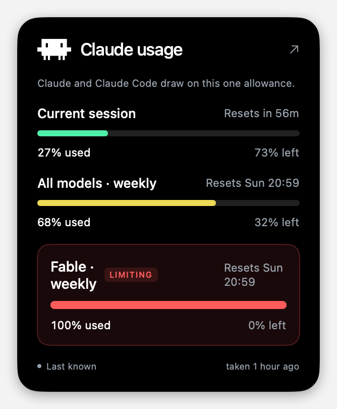
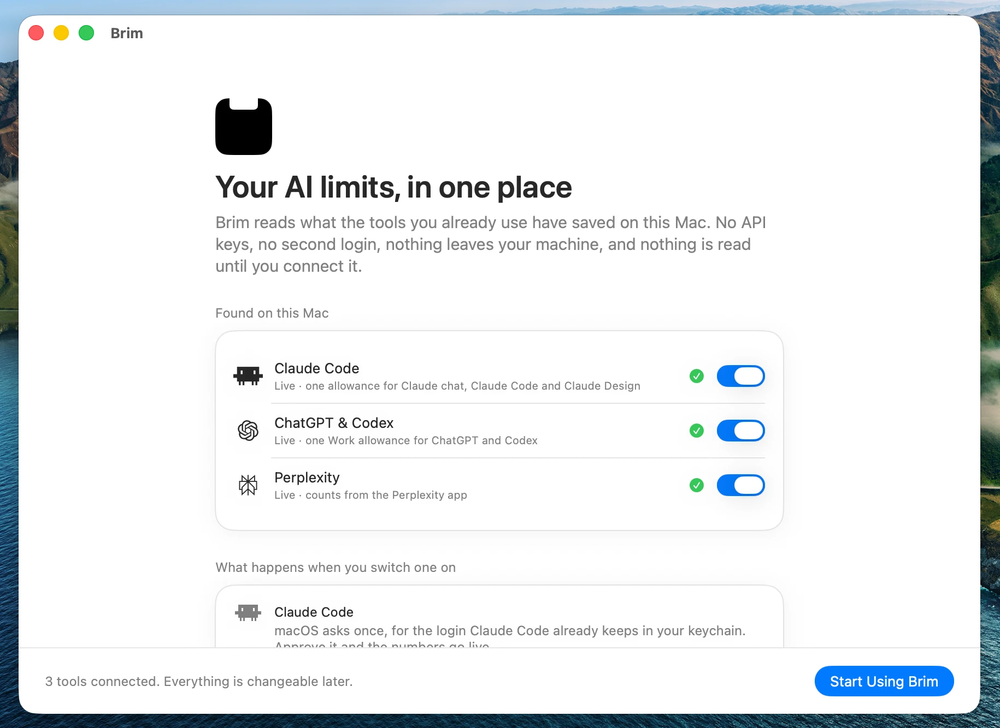

#  Brim

Your AI limits, on the edge of your screen.

[](https://github.com/miichaelhanna/Brim/actions/workflows/ci.yml)
[](https://github.com/miichaelhanna/Brim/releases/latest)
[](LICENSE)
[](#install)

*Brim* as in *full to the brim*: each ring fills as an allowance is used up, and the
whole thing sits on the brim of the display, out of the way until you look.



**No API keys. No second login. No password ever typed into this app.** Brim
finds the AI tools already on your Mac and reads what they have saved. **It reads
nothing until you connect it**, one button per tool: that button hands you to that
tool's own sign-in, and the app reads the result rather than holding a credential of
its own. Nothing connects itself on launch, and disconnecting stops all reading.

---



<p align="center">
  
</p>

## Why

If you pay for Claude, ChatGPT and a coding agent or two, your limits live in three
different places and you find out you've hit one at the worst possible moment.

Brim puts them on a screen edge, and does one thing most usage displays get
wrong: **it shows the limit that is actually stopping you.** Claude reports several at
once: a five-hour session limit, a weekly limit, and per-model weekly limits. Showing
the first one is misleading. If your session limit reads a comfortable 24% while a
weekly model limit sits at 84%, the number worth seeing is 84%.

## Install

[**Download Brim**](https://github.com/miichaelhanna/Brim/releases/latest/download/Brim.dmg),
drag it to Applications, and open it. That link always serves the newest release, and
every release is also kept under its own version on the [Releases](../../releases) page.

Brim lives in your menu bar, with no Dock icon unless you ask for one, and opens at
login so the numbers are there before you think to look. Both of those are switches in
Settings.

Releases are signed with a Developer ID and notarised by Apple, so they open without
warnings. If macOS ever says a build is unsigned or from an unidentified developer,
that build did not come from here, see [SECURITY.md](SECURITY.md).

Requires an Apple Silicon Mac on macOS 14 or later. The released build is arm64 only,
so it does not run on an Intel Mac.

Prefer to build it yourself? `bash Scripts/build.sh`.

## What it tracks

One ring per allowance. Claude and Claude Code draw on the same subscription, and
ChatGPT and Codex on the same Work allowance, so each pair is one ring rather than two
rings showing the same number.

| Ring | Covers | Where the numbers come from |
|---|---|---|
| **Claude** | Claude and Claude Code | Anthropic's usage endpoint, read with the login Claude Code already keeps on this Mac. Until macOS lets it read that login, it falls back to Claude Code's local cache. |
| **ChatGPT** | ChatGPT and Codex | Asks the ChatGPT app's own bundled engine. Brim never handles an OpenAI token. |

Both start disconnected. Brim lists only tools it can actually read, and reads none of
them until you press Connect on that row, in the first-run screen or in Connections.

<p align="center">
  
</p>

**Using something else?** Any tool that writes its usage to a file on your Mac can be
added by describing where the numbers are, in a small JSON file, with no Swift and no typing
figures in by hand. See [Docs/add-a-tool.md](Docs/add-a-tool.md). A tool that only
reports usage over the network needs an adapter, and Brim is open source precisely so
those can be added, see [Contributing](#contributing).

**On ChatGPT:** the figure shown is the *Work* allowance, which Codex meters too.
Regular Chat and Voice limits are not included, and are not available locally. The app
labels this rather than quietly presenting it as your whole ChatGPT usage.

## Live Claude updates

Claude Code writes its usage to your Mac, but only refreshes it occasionally, so a
reading can be days old. For live numbers Brim asks Anthropic directly, using the login
Claude Code already holds.

There is nothing to paste and no second login. **Turn on live updates** in Connections,
and macOS asks once whether Brim may read that saved login. Choose Always Allow and the
numbers go live. Brim only ever reads it: it cannot expire, rotate or invalidate that
login, so it cannot sign you out of Claude Code.

Skip it if you like: Brim then reads nothing from Claude at all, and the same button is
in Connections whenever you want it.

> **Why not `claude setup-token`?** Because it cannot work. A token from that command
> carries the `user:inference` scope alone, and Anthropic's usage endpoint requires
> `user:profile`, so every such token is answered with a 401. Claude Code gates its own
> usage fetch on the same scope. Earlier builds of Brim asked people to paste one of
> these tokens; that was a dead end, and it is gone.

## Privacy

The short version: **nothing leaves your Mac except a request to the provider whose
usage you asked for.**

- Nothing is read until you connect that tool. Finding one on disk is a list, not
  permission, and nothing connects itself on launch.
- No analytics, no telemetry, no crash reporting, no accounts, no server.
- The only outbound requests are to `api.anthropic.com` for your Claude usage.
- Brim never handles your OpenAI credentials at all. It asks the ChatGPT app's
  own engine and reads back the numbers.
- Your Claude token is stored in the macOS Keychain, not in a preferences file.
- It never writes to another app's configuration.

Full detail, file by file: [Docs/privacy.md](Docs/privacy.md).
Threat model and how to report a vulnerability: [SECURITY.md](SECURITY.md).

## Using it

- **Pick an edge** in Settings: top, right, bottom or left, or leave it on automatic.
  The only edge you cannot pick is the one your Dock is on; the notch always leaves
  that one to the Dock. The top edge hangs from the very top of the screen, and on a
  Mac with a notch it tucks into the hardware.
- **Drag the grip** inside the notch to move it along an edge, or onto another edge.
- **Hover a ring** for the full breakdown: every limit, when each resets, and when the
  reading was taken. **Click a ring** to refresh it.
- **Click a card** in the Overview to see its detail. The arrow next to the title opens
  that provider's own usage page.
- The menu bar item is always there, with everything: usage, refresh, position,
  visibility, and settings. A Dock icon is optional.

## Development

Requires macOS 14+ and Swift 6.

```bash
swift build
swift test
bash Scripts/build.sh      # builds, signs and packages into dist/
```

Useful flags:

| Flag | Does |
|---|---|
| `--diagnose-claude` | Prints exactly what the app can read for Claude, and why |
| `--welcome` | Forces the first-run screen |
| `--page <name>` | Opens a page directly: `usage`, `connections`, `notch` |
| `--show` | Opens the dashboard at launch |

Architecture notes: [Docs/architecture.md](Docs/architecture.md).
Adding a provider: [Docs/providers.md](Docs/providers.md).

## Contributing

**Try it first.** [Download it](../../releases), point it at your own accounts and see
whether the numbers match what your providers say. Bug reports from real use are worth
more than most patches: `--diagnose-claude`, `--diagnose-tools` and
`--diagnose-screen` each print what the app can actually see, and none of them expose a
credential, so the output is safe to paste into an issue.

**What it reads today:** Claude and Claude Code automatically, ChatGPT and Codex
automatically, and anything else you describe, see
[Add a tool](Docs/add-a-tool.md).

**Nothing about the design is specific to those.** Any tool that meters what you use,
a session limit, a weekly quota, a credit balance, fits the same shape: a percentage,
a reset time, the limit that is actually biting, and an honest label when a number is
an estimate rather than a fact. Adapters for Cursor, Antigravity, Grok, OpenCode and
GLM are all wanted; [Docs/providers.md](Docs/providers.md) says what is known about
where each keeps its usage.

**So the most useful contribution is an adapter for a tool you actually use.** Not
because the work is hard, but because it can only be verified by someone who has that
tool installed and signed in. Everything a new provider needs is in
[Docs/providers.md](Docs/providers.md), and the rules that keep the numbers trustworthy
are in [CONTRIBUTING.md](CONTRIBUTING.md).

If your tool isn't listed, open an issue saying which one and where it keeps its usage.
That is genuinely the first step.

## Licence

[MIT](LICENSE). Use it, fork it, ship it, sell it. The one condition is the usual MIT
one: keep the copyright notice and the licence text with whatever you ship, whether
that is source you forked or a binary you built. [NOTICE](NOTICE) spells out what that
looks like in practice, and how to credit the project if you build on it.

Brim is not affiliated with, endorsed by, or sponsored by Anthropic or OpenAI. Product
names and logos are trademarks of their respective owners, shown only to identify which
service each reading belongs to, and are not covered by the MIT licence.
